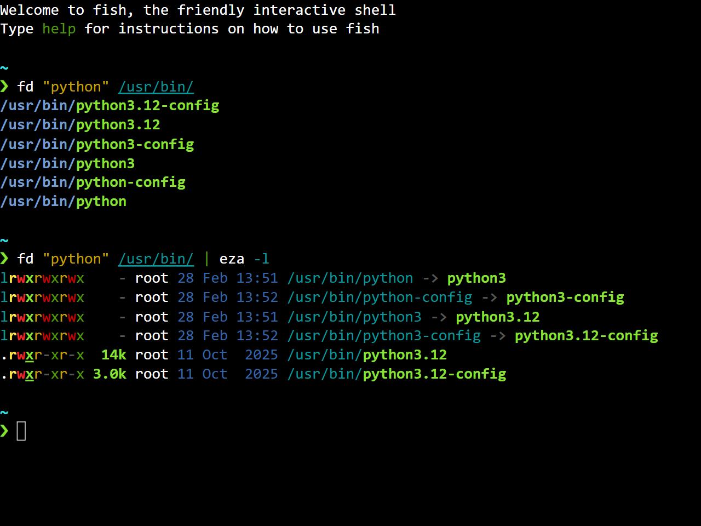

# CheerpX Virtual Machine
A better alternative to [WebVM](https://webvm.io/).

## Main features
- Latest version of [Alpine Linux](https://alpinelinux.org/) powered by [CheerpX](https://cheerpx.io/)
- Includes various modern tools (eza, bat, Zoxide, etc.), utilities (nano, micro, Midnight Commander, etc.) and development software (Python, Node.js, Lua, etc.)
- Comes with [Fish](https://fishshell.com/) as default shell
- Integrated with [Starship](https://starship.rs/) out of the box
- Terminal rendered using [Xterm.js](https://github.com/xtermjs/xterm.js/) with touch support
- It's free and open-source software (FOSS)... *forever*! [^1]

[^1]: CheerpX is proprietary software and it's free to use only for personal and open-source projects. See [this page](https://cheerpx.io/licensing/) for more information.

## How to deploy
Clone this repo, then go to Settings > Pages > Select "GitHub Actions" as Pages source. Then, go to Actions > Select "Deploy" action > Select "Run workflow" > Set proper parameters if needed > Select "Run workflow". Once done, the "deploy" job will show a link to your deployed GitHub Page.
